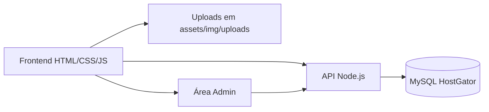

# Complexo Cairbar Schutel Site

Site institucional do Complexo Assistencial Cairbar Schutel, com páginas públicas, blog, área administrativa e backend em Node.js consumindo MySQL na HostGator.

## Visão Geral

O projeto reúne o site principal da instituição, páginas de campanhas e serviços, blog com posts dinâmicos, área administrativa protegida e uma API que conversa com o banco de dados da HostGator.

O objetivo é manter o conteúdo institucional e o blog centralizados, com atualização simples via painel administrativo e publicação em produção pela Vercel.



## Funcionalidades

- Página inicial institucional com seções editáveis.
- Blog com listagem de posts e página de post individual.
- Painel administrativo para criação, edição e remoção de posts.
- Gerenciamento de conteúdo da home.
- Upload de imagens para posts e seções da home.
- Páginas de apoio, doação, voluntariado, transparência e campanhas.
- Proteção da área administrativa por `.htaccess` na HostGator.

## Tecnologias

- Frontend: HTML, CSS e JavaScript.
- Backend: Node.js, Express e MySQL.
- Upload de arquivos: `multer` com armazenamento local em `assets/img/uploads`.
- Hospedagem: Vercel para a aplicação e HostGator para o banco de dados.

## Estrutura do Projeto

- `index.html`: página inicial do site.
- `pages/`: demais páginas públicas, incluindo blog e páginas institucionais.
- `admin/`: painel administrativo e páginas de login.
- `assets/css/`: estilos do site.
- `assets/js/`: scripts de frontend, blog, conteúdo da home e painel admin.
- `assets/img/`: imagens do site e uploads gerados pelo sistema.
- `assets/docs/`: documentos institucionais em PDF.
- `api/index.js`: entrada principal da API usada no deploy.
- `backend/`: variação separada do backend para uso local ou cenários específicos.
- `schema.sql`: estrutura do banco MySQL e dados iniciais.
- `vercel.json`: configuração de rewrite para a API.
- `admin/.htaccess`: proteção HTTP básica do painel.

## Como o Projeto Funciona

O frontend acessa a API para buscar e salvar posts e conteúdo da home. A API faz consultas no MySQL e também trata uploads de imagem.

Os dados ficam organizados em duas tabelas principais:

- `posts`: posts do blog.
- `home_content`: textos e imagens da página inicial.

Os arquivos enviados pelo painel são salvos localmente em `assets/img/uploads` e servidos pelo próprio site.

## Requisitos

Antes de rodar o projeto localmente, você precisa de:

- Node.js instalado.
- Acesso a um banco MySQL na HostGator.
- Um navegador moderno.
- Opcionalmente, `npm` ou `pnpm` para instalar dependências, conforme o fluxo que você usar.

## Configuração do Ambiente

### 1. Variáveis de ambiente

Crie um arquivo `.env` na raiz do projeto com base no `.env.example` local e preencha as credenciais do banco.

Variáveis usadas pela API principal:

- `DB_HOST`
- `DB_PORT`
- `DB_NAME`
- `DB_USER`
- `DB_PASSWORD`
- `DB_SSL`
- `PORT`
- `NODE_ENV`

Exemplo:

```env
DB_HOST=seu_host_hostgator
DB_PORT=3306
DB_NAME=seu_banco
DB_USER=seu_usuario
DB_PASSWORD=sua_senha
DB_SSL=false
PORT=3000
NODE_ENV=development
```

### 2. Banco de dados

Se você estiver montando o banco do zero, importe [schema.sql](schema.sql) na base MySQL da HostGator. Esse arquivo cria as tabelas `posts` e `home_content` e também inclui dados iniciais.

### 3. Dependências

Na raiz do projeto:

```bash
npm install
```

Se você for usar a pasta `backend/` como servidor separado em vez da API principal da raiz:

```bash
cd backend
npm install
```

## Como Executar Localmente

### API principal

Na raiz do projeto:

```bash
npm start
```

Isso inicia a API definida em [api/index.js](api/index.js).

### Backend alternativo

Se quiser usar o servidor separado da pasta `backend/`:

```bash
cd backend
npm run dev
```

### Acesso no navegador

Depois de subir a API, abra o site pelo navegador ou pelo servidor local que você estiver usando. O frontend detecta quando está em ambiente local e usa `http://localhost:3000/api`.

## Deploy

### Vercel

O arquivo [vercel.json](vercel.json) direciona as chamadas `/api/*` para `/api/index.js`.

### HostGator

O banco MySQL fica na HostGator. A área administrativa pode ser protegida com [admin/.htaccess](admin/.htaccess) e com o arquivo `.htpasswd` fora da pasta pública.

### Upload de imagens

Os uploads são gravados em `assets/img/uploads`. Se o deploy for feito em um ambiente sem persistência de disco, você deve adaptar essa parte antes de usar em produção.

## Administração

O painel administrativo permite:

- Criar novos posts.
- Editar posts existentes.
- Excluir posts.
- Atualizar conteúdo da home.
- Fazer upload de imagens vinculadas ao conteúdo.

O acesso ao painel é protegido em dois níveis:

- proteção HTTP básica via `.htaccess` na HostGator;
- validação de sessão no frontend para separar login e painel.

## Rotas da API

Rotas principais expostas pela API:

- `GET /api/health` - teste de saúde da aplicação.
- `GET /api/posts` - lista todos os posts.
- `GET /api/posts/:id` - retorna um post específico.
- `POST /api/posts` - cria um post.
- `PUT /api/posts/:id` - atualiza um post.
- `DELETE /api/posts/:id` - remove um post.
- `POST /upload` - faz upload de imagem.
- `GET /api/home-content` - lista o conteúdo da home.
- `POST /api/home-content` - salva conteúdo da home.

## Arquivos Importantes

- [README.md](README.md): documentação principal.
- [schema.sql](schema.sql): criação do banco.
- [api/index.js](api/index.js): API principal.
- [backend/server.js](backend/server.js): servidor alternativo.
- [vercel.json](vercel.json): regras de rewrite.
- [admin/.htaccess](admin/.htaccess): proteção do painel.

## Boas Práticas de Publicação

- Não publique `.env`.
- Não publique arquivos de IDE.
- Não publique dumps ou backups do banco.
- Revise imagens e documentos antes de subir para o repositório público.
- Se algum arquivo de configuração já tiver sido commitado antes, remova do índice do Git antes de abrir o PR.

## Contribuição

Se você for contribuir com o projeto:

1. Crie uma branch de trabalho.
2. Faça as alterações.
3. Teste localmente.
4. Abra um pull request para revisão.

## Créditos

- Gabriel Sousa
- Mariana Hoffmann
